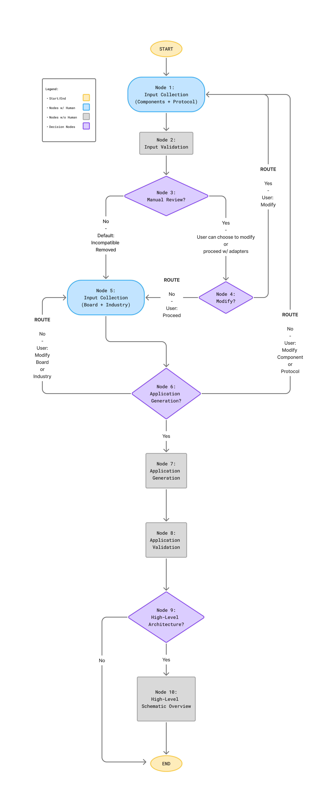

# Workflow

## 1. Overview

This workflow is designed to assist users in generating realistic, technically grounded application ideas for ESP32 systems. It guides users through selecting hardware components, a communication protocol, a development board, and a target industry. The chatbot validates hardware compatibility and offers users the opportunity to manually review and adjust their setup before generating tailored application suggestions.

**Step-by-step experience:**

1. User provides a list of hardware components and selects either I2C or SPI as the protocol.
2. The chatbot validates each component’s compatibility with the chosen protocol.
3. User is asked whether they want to manually review the validation results.
4. If yes, they can modify the component list, change the protocol, or proceed using adapters.
5. Once finalized, the user selects a dev board and target industry.
6. The chatbot offers to generate 3–4 project ideas based on all inputs.
7. If the user is not satisfied, they can return to modify earlier inputs.
8. Each generated project idea is internally validated by the LLM to ensure feasibility
9. User is offered the option to generate high-level schematics for each idea
10. If yes, the schematic is generated and output is finalized.
11. If no, the workflow ends with a list of project ideas

**Why a structured workflow instead of freeform chat?**

Using LangGraph ensures that:

- Input collection and validation are predictable and guided.
- The assistant maintains memory across the conversation.
- The user stays in control and can revisit or adjust choices without starting over.

---

## 2. Workflow Goals

- **Primary Outcomes:**
  - Validate hardware setup.
  - Identify compatibility issues and required adapters.
  - Receive tailored, grounded project suggestions.
- **Features:**
  - Adaptive branching based on user feedback.
  - Memory of changing user state via structured JSON.
  - Presentation of system limitations (e.g., incompatible components).
  - LLM-powered application generation (may have validation either via LLM or tool).
- **What This Workflow Must Maintain:**
  - Structured JSON-based state across all steps.
  - Retained memory of all user inputs across states
  - Accurate protocol compatibility feedback.
  - Clear state transitions.
  - Clarity in presenting technical decisions and their consequences.

---

## 3. State Diagram



---

## 4. Step-by-Step State Descriptions

### 4.1 Node 1: Input Collection (Components + Protocol)

- **Function**: `collect_input_components_protocol`
- **Description**: Collects user-specified component list and preferred communication protocol (I2C or SPI).
- **Inputs Expected**: Comma-separated list of components, plus one protocol (`i2c` or `spi`)
- **Outputs**:
  ```json
  {
    "components": ["BME280", "LCD1602"],
    "protocol": "i2c"
  }
  ```
- **Tools / Agents Used**: LLM with format checking (in prompt)
- **Validation Logic**:
  - Ensure non-empty component list
  - Ensure protocol is valid
  - Retry until both are correct
- **Next Step**: [_validate_input_](#42-node-2-input-validation)

### 4.2 Node 2: Input Validation

- **Function**: `validate_input`
- **Description**: Validates compatibility of each component with the selected protocol.
- **Inputs Expected**:
  - components
  - protocol
- **Outputs**:
  ```json
  {
    {
      "components": ["BME280", "LCD1602"],
      "protocol": "i2c",
      "validated_components": [
          {
            "component": "LCD1602",
            "native_protocols": ["SPI"],
            "compatible_with_selected": "No",
            "needs_adapter": "Yes",
            "suggested_adapter": "PCF8574",
            "notes": "Incompatible with I2C"
          }
      ]
    }
  }
  ```
  | Component | Native Protocols | Compatible with Selected | Needs Adapter? | Suggested Adapter | Notes                            |
  | --------- | ---------------- | ------------------------ | -------------- | ----------------- | -------------------------------- |
  | LCD1602   | Parallel         | Yes                      | Yes            | PCF8574           | Requires PCF8574 adapter for I2C |
  | BME280    | I2C, SPI         | Yes                      | No             |                   |                                  |
- **Tools / Agents Used**: LLM (knowledge tied to model selected)
- **Validation Logic**:
  - Lookup known native protocols
  - Check match with selected protocol
  - Mark compatibility, adapter needs, and add relevant notes
- **Next Step**: [_manual_review_decision_](#43-node-3-manual-review)

### 4.3 Node 3: Manual Review?

- **Function**: `manual_review_decision`
- **Description**: User is presented with validation results and asked if they want to manually review and adjust.
- **Inputs Expected**: “yes” or “no”
- **Outputs**:
  ```json
  {
    "manual_review_flag": true
  }
  ```
  or
  ```json
  {
    "manual_review_flag": false,
    "components": [
      // compatible components only
    ]
  }
  ```
- **Tools / Agents Used**: LLM
- **Validation Logic**:
  - If `false`, remove incompatible components automatically
  - If `true`, continue to next decision step
- **Next Step**:
  - If `false`: [_collect_input_board_industry_](#45-node-5-input-collection-board--industry)
  - If `true`: [_modify_components_protocol_decision_](#44-node-4-modify)

### 4.4 Node 4: Modify?

- **Function**: `modify_components_protocol_decision`
- **Description**: Presents review options to the user: modify components, change protocol, or proceed with adapters.
- **Inputs Expected**: `“modify”`, `“different protocol”`, or `“proceed”`
- **Outputs**: Routing decision only
- **Validation Logic**:
  - Classify user intent into one of the three valid actions
- **Next Step**:
  - `“modify”` or `“different protocol”` &rarr; [_collect_input_components_protocol_](#41-node-1-input-collection-components--protocol)
  - `“proceed”` &rarr; [_collect_input_board_industry_](#45-node-5-input-collection-board--industry)

### 4.5 Node 5: Input Collection (Board + Industry)

- **Function**: `collect_input_board_industry`
- **Description**: Collects development board model and target industry.
- **Inputs Expected**:
  - Board name (e.g. “ESP32 DevKit V1”)
  - Industry (e.g. “smart agriculture”)
- **Outputs**:
  ```json
  {
    "components": [...],
    "validated_components": [...],
    "protocol": "i2c",
    "board": "ESP32 DevKit V1",
    "industry": "smart agriculture"
  }
  ```
- **Tools / Agents Used**: LLM
- **Validation Logic**:
  - Ensure board is recognized
  - Ensure industry is non-empty and relevant
- **Next Step**: [_application_generation_decision_](#46-node-6-application-generation)

### 4.6 Node 6: Application Generation?

- **Function**: `application_generation_decision`
- **Description**: User is asked whether they’d like to generate grounded application ideas based on the setup.
- **Inputs Expected**: “yes” or “no”, or a change request
- **Outputs**:
  - If `“yes”`: flow continues to idea generation
  - If `“no”`: classification of what user wants to change
- **Tools / Agents Used**: LLM
- **Validation Logic**:
  - If request is ambiguous, follow up with clarification
- **Next Step**:
  - `"yes"` &rarr; [_generate_applications_](#47-node-7-application-generation)
  - `"no"` &rarr; `“modify”` or `“different protocol”` ` &rarr; [_collect_input_components_protocol_](#41-node-1-input-collection-components--protocol)
  - `"no"` &rarr; `“modify”` or `“different protocol”` ` &rarr; [_collect_input_board_industry_](#45-node-5-input-collection-board--industry)

### 4.7 Node 7: Application Generation

- **Function**: `generate_applications`
- **Description**: Generates 3–4 grounded project ideas based on complete setup.
- **Inputs Expected**:
  - Full JSON state (components, protocol, board, industry)
- **Outputs**:
  ```json
  {
    "application_ideas": [
        {
            "name":
            ...
        },
        {
            "name":
            ...
        },
    ]
  }
  ```
- **Tools / Agents Used**: LLM
- **Validation Logic**: Possibly another tool or additional LLM call for validation
- **Next Step**: [_validate_applications_](#48-node-8-application-validation)

### 4.8 Node 8: Application Validation

- **Function**: `validate_applications`
- **Description**: Validates each application idea for technical quality and alignment using structured criteria.
- **Inputs Expected**:
  - JSON array of ideas from `generate_applications`
  - Context: components, protocol, board, industry
- **Validation Logic**:
  - For each idea:
    - Grounded: Is it based on actual hardware capability?
    - Feasible: Can it be reasonably built with selected parts?
    - Relevant: Is it clearly tied to the specified industry/domain?
    - Complete: Does it use all listed components?
- **Output Format**:
  ```json
  {
    "application_ideas_validated": [
      {
        "original_idea": "Smart irrigation system...",
        "grounded": true,
        "feasible": true,
        "relevant": true,
        "uses_all_components": false,
        "issues_detected": ["Does not use LCD module"],
        "fixed_idea": "Smart irrigation system with BME280 and LCD1602 for time-logged events"
      },
    ...
    ]
  }
  ```
- **Tools / Agents Used**: LLM with validation prompt (maybe optional tool node with component capability database)
- **Next Step**: [_schematic_generation_decision_](#49-node-9-high-level-architecture)

### 4.9 Node 9: High-Level Architecture?

- **Function**: `schematic_generation_decision`
- **Description**: Ask user whether they want a high-level schematic overview of one or more validated application ideas.
- **Inputs Expected**: Yes/No
- **Outputs**:
  - If `"yes"`: flow continues to schematic generation
  - If `"no"`: flow ends
- **Tools / Agents Used**: LLM
- **Validation Logic**:
  - If request is ambiguous, follow up with clarification
- **Next Step**:
  - `"yes"` &rarr; [_generate_schematic_](#410-node-10-high-level-schematic-overview)
  - `"no"` &rarr; _END_

### 4.10 Node 10: High-Level Schematic Overview

- **Function**: `generate_schematic`
- **Description**: Produces a high-level schematic diagram for each validated application.
- **Inputs Expected**:
  - JSON array of validated ideas from `validate_applications`
  - Context: components, protocol, board, industry
- **Output**: ASCII/diagram output, overview, JSON pin map
- **Tools / Agents Used**: LLM
- **Validation Logic**:
  - Represent all components selected in earlier steps
  - Reflect real-world wiring:
    - Shared I²C/SPI buses
    - GND/VCC connections
    - Pull-up resistors for I²C (include pads if added)
    - Logic level matching (insert level shifters if needed)
  - Ensure pin mappings follow protocol and board specs
  - Avoid GPIO conflicts across components
- **Next Step**: _END_

## 5. Conditional Logic and Edges

| Source Node                         | Condition                                  | Destination Node                    |
| ----------------------------------- | ------------------------------------------ | ----------------------------------- |
| manual_review_decision              | "no"                                       | collect_input_board_industry        |
| manual_review_decision              | "yes"                                      | modify_components_protocol_decision |
| modify_components_protocol_decision | "modify" or "different protocol"           | collect_input_components_protocol   |
| modify_components_protocol_decision | "proceed"                                  | collect_input_board_industry        |
| application_generation_decision     | "yes"                                      | generate_applications               |
| application_generation_decision     | "modify component" or "different protocol" | collect_input_components_protocol   |
| application_generation_decision     | "modify board" or "different industry"     | collect_input_board_industry        |
| schematic_generation_decision       | "yes"                                      | generate_schematic                  |
| schematic_generation_decision       | "no"                                       | END                                 |

## 6. Work-in-Progress / Questions

- [ ]
- [ ]
- [ ]

## 7. Appendix

List tools, prompts, and agents used at each step.
